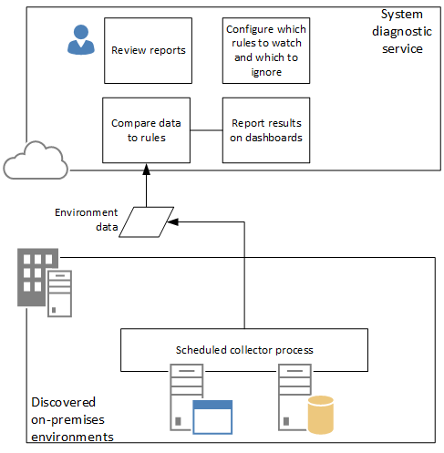

# System diagnostics (Lifecycle Services, LCS) 

In Microsoft Dynamics Lifecycle Services, System diagnostics helps administrators monitor and understand the health of one or more Microsoft Dynamics AX environments. It is a cloud-based tool that has a locally-installed component that can be configured to perform the following tasks:
-   Discover on-premises Microsoft Dynamics AX environments (database instances and Microsoft Dynamics AX Application Object Server (AOS) instances).
-   Collect data from the environments that were discovered.
-   Run rules on the collected data.
-   Report rule violations on a dashboard.
-   Provide reports.

Data is collected by using jobs that run on predefined schedules. The following diagram describes how System diagnostics and the locally-installed components interact.
System diagnostic service

 

System diagnostics supports the following versions of Microsoft Dynamics AX:
-   Microsoft Dynamics AX 2012 R2
-   Microsoft Dynamics AX 2012 Feature Pack
-   Microsoft Dynamics AX 2012
-   Microsoft Dynamics AX 2012 R3

## Prerequisites
Before you can use the System diagnostics, you must complete the following tasks:
-   Download and run the installer for the Diagnostic service.
-   Run the Discovery wizard.
-   Schedule or run data collection.

## Getting started
The following topics explain how to install and use System diagnostics.
-   [Install and run System diagnostics](install-run-system-diagnostics.md)

